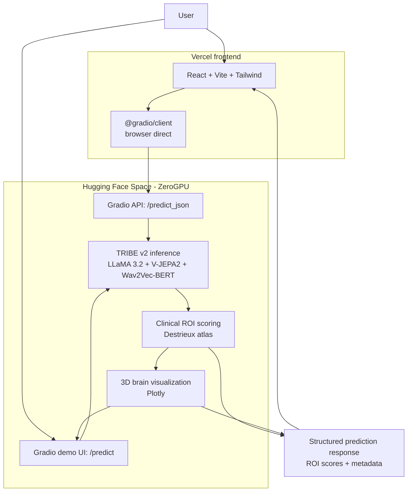

# Neuro Cue

> **Neural Stimulus Optimizer for Speech-Language Pathology**
> Brain-encoding model for predicting neural engagement to therapy stimuli.

[](https://neuro-cue.vercel.app)
[](https://huggingface.co/spaces/rohany395/neuro-cue)
[](LICENSE)

## 🚀 Live Demos

| Interface | URL | Description |
|-----------|-----|-------------|
| **Web App** | [neuro-cue.vercel.app](https://neuro-cue.vercel.app) | Custom React frontend on Vercel |
| **Gradio Demo** | [huggingface.co/spaces/rohany395/neuro-cue](https://huggingface.co/spaces/rohany395/neuro-cue) | Full Gradio interface with 3D brain visualization |

Both interfaces call the same inference backend running real TRIBE v2 on Hugging Face's ZeroGPU (free tier).

---

## What It Does

Neuro Cue is a visualization layer over Meta's TRIBE v2 brain encoder. TRIBE v2 predicts cortical activity (BOLD signal across 20,484 vertices) in response to video, audio, and text stimuli. Neuro Cue wraps that output in an interactive 3D brain map and aggregates predictions over four anatomically-defined language regions (Broca's, Wernicke's, SMA, Angular Gyrus, mapped via the Destrieux atlas) — making the model's predictions inspectable for people learning about language neuroanatomy.

**This is a research prototype. Not a medical device.**

## Why This Matters

SLP curriculum and clinical training often rely on intuition or expensive fMRI studies to evaluate stimulus design. Neuro Cue gives clinicians and educators an instant, free preview of which brain regions a stimulus is likely to engage — based on a state-of-the-art foundation model trained on 700+ subjects' fMRI data.

## How It Works

1. **Input:** Submit a video, audio, or text sample (a therapy stimulus)
2. **Inference:** TRIBE v2 predicts BOLD response across 20,484 cortical vertices
3. **Clinical layer:** Predictions are mapped to four language ROIs using the Destrieux atlas
4. **Visualization:** Interactive 3D brain heatmap + ROI score breakdown

## Architecture



## Repository Structure

Key project files:

```text
.
├── gradio-space/        # Live HF Spaces deployment (Gradio + ZeroGPU)
│   ├── app.py
│   ├── requirements.txt
│   ├── packages.txt
│   └── README.md
├── frontend/            # React + Vite frontend (deployed on Vercel)
│   ├── src/
│   │   ├── App.jsx
│   │   ├── components/
│   │   ├── hooks/
│   │   └── services/api.js
│   ├── package.json
│   └── vite.config.js
├── README.md
└── LICENSE
```

## Tech Stack

**Inference & ML:**
- [TRIBE v2](https://huggingface.co/facebook/tribev2) (Meta's brain encoder, 2026)
- LLaMA 3.2-3B, V-JEPA2, Wav2Vec-BERT (TRIBE's frozen encoders)
- PyTorch + ZeroGPU (Hugging Face's serverless GPU)
- nilearn (Destrieux atlas, fsaverage5 mesh)
- Plotly (3D brain visualization)

**Backend (deployed):**
- Gradio 6.10 on Hugging Face Spaces

**Frontend (deployed):**
- React 18 + Vite + TailwindCSS
- @gradio/client (browser direct Space access)
- Deployed on Vercel

## What I Built vs. What I Used

**Used (off-the-shelf):**
- TRIBE v2 model weights and inference API
- Gradio framework
- nilearn brain visualization utilities

**Built:**
- Clinical ROI scoring layer (Destrieux atlas → 4 SLP-relevant regions)
- Interactive 3D brain visualization with timestep slider
- Custom React frontend that calls the public Hugging Face Space API directly
- Two-interface architecture (Gradio + React) calling shared inference backend
- Deployment pipeline: ZeroGPU + Vercel + GitHub
- Validation methodology (sensitivity, determinism, plausibility tests)

## Local Development

### Frontend

```bash
cd frontend
npm install
cp .env.local.example .env.local   # optional; override VITE_SPACE_URL if needed
npm run dev
```

The React frontend uses `@gradio/client` in the browser to call the public Hugging Face Space:

```bash
VITE_SPACE_URL=https://rohany395-neuro-cue.hf.space/
```

Do not expose Hugging Face tokens or shared prediction secrets with a `VITE_` prefix; Vite embeds those values in the public JavaScript bundle. The Vercel `/api/predict` route is health-only and does not proxy predictions.

**Video uploads:** Vercel serverless functions reject request bodies over ~4.5 MB. The React app uploads video **directly to the Hugging Face Space** (`@gradio/client` + `VITE_SPACE_URL`) and then calls the Space's `/predict_json` API with the returned Gradio file reference. Text predictions use the same direct Space API.

### Gradio Space

```bash
cd gradio-space
pip install -r requirements.txt
python app.py
```

## Citation

If you reference this project, please also cite the underlying TRIBE v2 paper:

```bibtex
@article{dAscoli2026TribeV2,
  title={A foundation model of vision, audition, and language for in-silico neuroscience},
  author={d'Ascoli, Stéphane and Rapin, Jérémy and Benchetrit, Yohann and others},
  year={2026}
}
```

## License

CC BY-NC 4.0 — inherited from TRIBE v2's license. Educational and research use only. Not for commercial use.

---

Built by [Rohan](https://github.com/rohany395) — M.S. Information Systems, Syracuse University (2026).